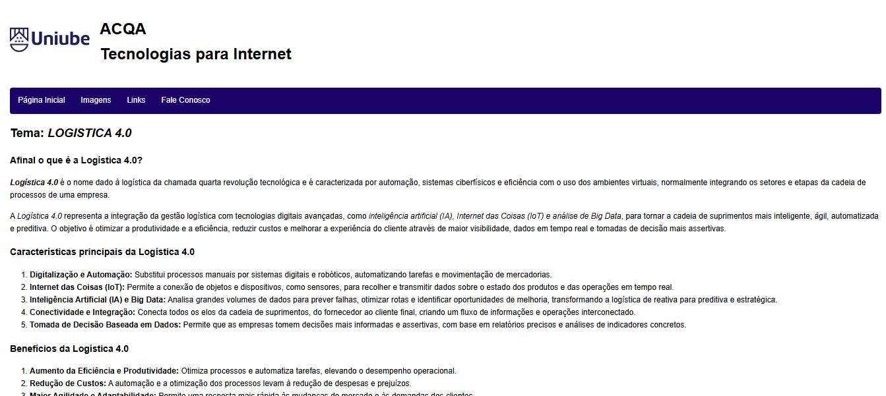
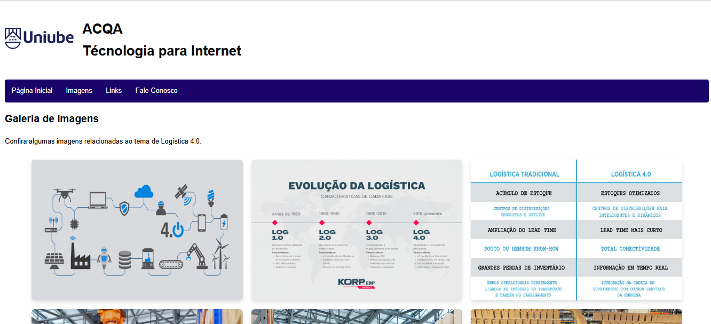
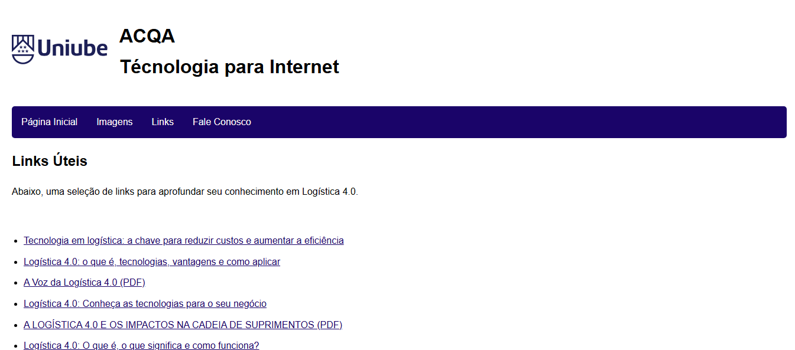
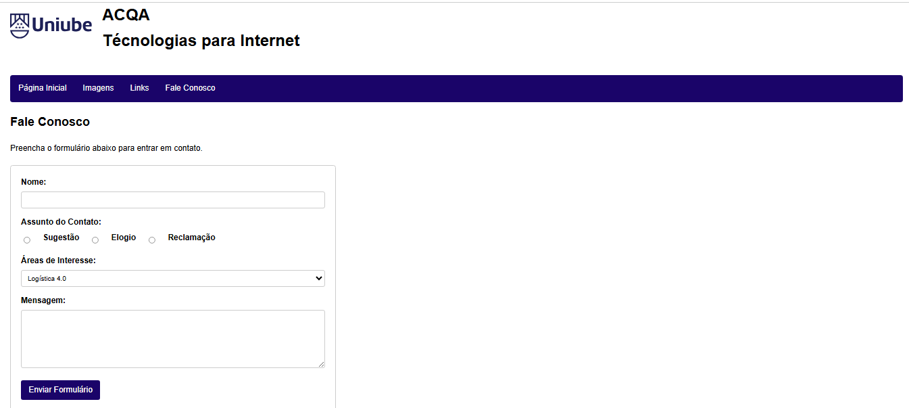

# 🌐 Projeto Web Acadêmico – Logística 4.0

Este projeto foi desenvolvido como parte da disciplina **Tecnologias para Internet** da Uniube. O objetivo era criar uma página web temática utilizando HTML e CSS, com estrutura de navegação entre páginas e elementos interativos.

## 📌 Tema

**Logística 4.0** – A quarta revolução tecnológica aplicada à cadeia de suprimentos, com foco em automação, integração digital e inteligência artificial.

---

## 🧰 Tecnologias Utilizadas

- HTML5 (com estilização embutida via `<style>` no próprio código)

---

## 📁 Estrutura do Projeto

- `index.html` – Página inicial com conteúdo explicativo sobre Logística 4.0  
- `imagens.html` – Galeria de imagens relacionadas ao tema  
- `links.html` – Links externos para aprofundamento no assunto  
- `faleconosco.html` – Página com formulário de contato
- 
---

## 🖥️ Capturas de Tela

### Página Inicial

### Página de Imagens

### Página de Links

### Página Fale Conosco

